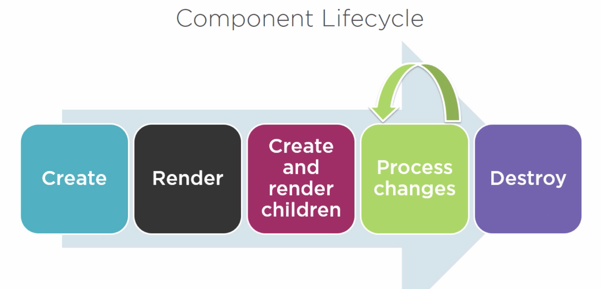

# Conceptos avanzados

Seguimos con conceptos de Angular: Interfaces, Estilos especiales (CSS) para los componentes, Lifecycle Hooks, Nested Components, Routing.

## Mejorando nuestros componentes

Cuando queremos construir buenos componentes, queremos asegurarnos de que todo esté fuertemente encapsulado: de que los estilos estén encapsulados, el template, la lógica de las clases, que respondamos a los eventos del ciclo de vida de componentes apropiadamente, y transformemos los datos a valores user-friendly a medida que los vayamos precisando.

Como los componentes **son el building block esencial de toda app en Angular**, lo más limpios, mantenibles y extensibles que sean estos componentes, mejor será nuestra aplicación. Entonces, ¿cómo mejoramos nuestros componentes?

- Usar Strong Typing permite minimizar los errores y favorecer el 'tooling'. TypeScript nos da las ventajas de tener tipos que nos tren al mundo del front-end las ventajas que teníamos a nivel del backend (intellisense, sugerencias, correcciones de sintaxis, etc).
- Usar Interfaces para aquellos objetos que no tienen un tipo particular.
- Encapsular los estilos para el component.
- Los componentes tienen un **ciclo de vida** que es manejado mismo por Angular. Angular provee *ganchos* para este ciclo de vida, o *‘lifecycle hooks’*  que nos permiten hacer cosas en diferentes etapas del ciclo de vida de un component.

Lo interesante aquí también es no olvidarse de mantener siempre los lineamientos de guías de estilo que engloban buenas prácticas, convenciones, patrones y principios del desarrollo en Angular, aquí es interesante seguir la guía de estilos oficial de Angular, trabajada por John  Papa, uno de los desarrolladores más reconocidos que usan este Framework:

https://angular.io/docs/ts/latest/guide/style-guide.html

## Interfaces en Angular

Como ya sabemos, TypeScript tiene un tipado fuerte (Strong Typing), sin embargo muchas veces podemos encontrarnos con algo así:

```typescript
pageTitle: string;
showImage: boolean;
homeworks: any[]; // Esto no tiene tipo!
```

Donde la property ```homeworks``` es un array de cualquier tipo. Para asegurarnos de que dichos elementos cumplan con cierta especificación en particular, podemos definir interfaces.

Como ya sabemos, una **interfaz** es una **especificación/contrato de un conjunto de métodos y properties**. Las clases que cumplan con dicha especificación o contrato se dicen que **implementan** tal interfaz.
ES5 y ES2015 no soportan interfaces, pero sí TypeScript, en consecuencia no existirá nada de esto en el JavaScript resultado de la transpilación.

La sintaxis es como sigue:
```typescript
export interface IExercise {
    id:string;
    problem:string;
    score:number;
}

export interface IHomework {
    id:string;
    description:string;
    score:number;
    dueDate:Date;
    exercises:Array<IExercise>;
}
```

Pudiendo entonces tener:

```typescript
pageTitle: string;
showImage: boolean;
homeworks: IHomework[];
```

## Estilos especiales (css) para nuestros componentes.

Cuando construimos el template para nuestro component, muchas veces necesitamos estilos particulares para dicho componente. Por ejemplo, si estamos construyendo una barra de navegación lateral o un listado, seguramente queramos que los elementos ```<li>``` o ```<div>``` tengan un estilo particular. 

En consecuencia, es necesario que evaluemos alguna forma de que nuestros componentes tengan dichos estilos únicos. La opción más rápida puede ser pensar poner los **estilos inline dentro del template HTML** (por ejemplo: ```<div style="display='none'; background-color='red'"> </div>```). Sin embargo, esta opción a nivel de responsabilidades no es prolija, y también hace que a futuro los estilos sean difíciles de mantener, y de obtener reuso entre estilos.

Otra opción es definir los **estilos y referenciarlos como un link dentro del index.html**, por ejemplo usando ```<link rel="stylesheet" href="misEstilosLindos.css">```. Esto es más fácil de mantener, pero hace que el componente solo se vea adecuadamente si dicha stylesheet fue referenciada. Aquí el componente no tiene forma de asegurar que dichos estilos existen. En consecuencia, nuestros componentes no serán tan facilmente reusables, debido a que no son autocontenidos.

Sin embargo, hay una opción más prolija y reusable: **agregar estilos únicos directamente en la metadata del componente utilizando la property styles o styleUrls, siendo esta segunda opción la mejor**. Tanto la property ```styles``` como ```styleUrls``` son arrays, de manera que podemos agregar múltiples estilos o múltiples hojas de estilos, siempre separados por coma.


Siguiendo con nuestro ejemplo, le agregaremos estilos a nuestro ```HomeworksListComponent```.

1) Ahora dentro de la carpeta ```app/homeworks-list``` creamos un nuevo archivo ```homeworks-list.component.css```.

2) Le agregamos el siguiente contenido simple:

```css
thead {
    color: #337AB7;
    font-size: 16px;
}
```

3) Editamos la metadata de nuestro HomeworksListComponent para que use dichos estilos:

```typescript
@Component({
  selector: 'app-homeworks-list',
  templateUrl: './homeworks-list.component.html',
  styleUrls: ['./homeworks-list.component.css']
})
export class HomeworksListComponent implements OnInit {}
```

## Ciclo de vida de los componentes: Hooks

Todo componente de Angular, tiene un ciclo de vida. Dicho ciclo de vida (lifecycle) es gestionado mismo por Angular:

1) Angular **crea** los componentes.
2) Luego **renderiza** los componentes.
3) Una vez esto, Angular **crea y renderiza** los componentes hijos.
4) Durante la operativa normal, Angular **procesa los cambios** sobre uncomponente cuando sus "properties enlazadas" (data bound properties) cambian
5) Y finalmente **destruye** el componente antes de destruir el template del DOM.



Lo interesante aquí es ver cómo Angular provee un conjunto de *lifecycle hooks* o simplemente 'ganchos' para que los desarrolladores de componentes podamos hacer algo en cada etapa del ciclo de vida, cuando lo deseemos. Esto nos permite realizar operaciones a demanda. Por ahora veremos solo los tres más comunes:

- **OnInit**: Inicialización del componente. Es un buen lugar para obtener los datos del backend.
- **OnChanges**: Ejecutar acciones después del cambio de input properties. Todavía no hemos visto este tipo de properties pero nos permiten hacer cosas interesantes.
- **OnDestroy**: Para hacer un limpiado de los recursos que usa el componente (un CleanUp) antes de que el componente muera

Para usar un *lifecycle hook*, necesitamos hacer que nuestro componente implemente la interfaz existente para el gancho que se desee usar. Haremos una implementación de estas interfaces (donde cada interfaz tiene simplemente un método), y le daremos nuestra lógica particular.

Cada hook/interfaz define un método que es ```ngNombreHook```. Por ejemplo la interfaz ```OnInit``` define el hook ```ngOnInit```.

Hagamos un ejemplo muy simple implementando justamente ```OnInit```:

1) Importemos la interfaz ```OnInit``` desde '@angular/core':
```typescript 
import { Component, OnInit } from '@angular/core';
```

2) Nuestra clase de nuestro component ```HomeworksListComponent``` debe ahora implementar ```OnInit```:
```typescript 
export class HomeworksListComponent implements OnInit {...}
```

3) Implementamos ```ngOnInit``` en la clase:
```typescript
ngOnInit(): void {
    console.log("aca obtengo datos del backend!");
}
```

## Componentes anidados o Nested components

Muchas veces nuestra aplicación va a tener features que son lo suficientemente complejas como para tratarlas de forma aislada, o donde existe una gran posibilidad de generar reuso en diferentes casos de uso, y por ende separarlas en componentes diferentes.
Veremos ahora como hacer componentes anidados o `Nested Componentes` y como generar interacción entre el componente **contenedor** y el componente **anidado**. Estos componentes van a mandar datos de un lado para el otro, usando inputs y mandando outputs al componente contenedor.

Hay dos formas de usar componentes anidados:

1) A traves de su directiva (como ya vimos en el index.html)
2) A traves de routing, indicandole a un componente que tiene que rutear a otro componente (lo veremos más adelante cuando demos routing). 

Por ahora usaremos la opción 1. El criterio que utilizaremos para indicar si un componente es 'anidable' o no, es simplemente a partir de **evaluar si su template maneja una parte de una view más grande, y obviamente si tiene un selector y una forma de comunicación con su contenedor**.


Supongamos que nuestras Tareas de nuesta API tienen una popularidad asociada. Creemos ahora un nested component que lo que haga es mostrar estrellitas por cada tarea que tengamos. Lo que queremos hacer es que el mostrado de estrellitas sea un componente aparte, que maneje su propia interacción tanto de inputs de sus componentes contenedores, como de outputs hacia otros componentes.

### 1) Creamos los archivos para nuestro StarComponent

En primer lugar, creamos nuesto componente con el commando: ```ng generate component Star```

### 2) Creamos el StarComponent 

Dentro de ```star.component.ts```, pegamos el siguiente código:

```typescript
import { Component, OnChanges } from '@angular/core';

@Component({
  selector: 'app-star',
  templateUrl: './star.component.html',
  styleUrls: ['./star.component.css']
})
export class StarComponent implements OnChanges {
    
    rating: number = 4; //hardcodeamos un valor por defecto para ver algo
    starWidth: number;

    ngOnChanges():void {
        //86 es el width de nuestras estrellitas (ver el template)
        //como estamos implementando el OnChanges, cada vez que el valor de 'rating' cambie
        //esto se va a refrescar
        this.starWidth = this.rating * 86/5; 
    }
}
```

### 3) Creamos el Template para nuestro StarComponent y sus estilos

Dentro de ```star.component.html```, pegamos el siguiente código:

```html
<div clas="crop"
    [style.width.px]="starWidht"
    [title]="rating">
    <div style="width:86px">
        <span class="glyphicon glyphicon-star"></span>
        <span class="glyphicon glyphicon-star"></span>
        <span class="glyphicon glyphicon-star"></span>
        <span class="glyphicon glyphicon-star"></span>
        <span class="glyphicon glyphicon-star"></span>
    </div>
</div>
```

A su vez, vamos a ```star.component.css```, y pegamos el siguiente código:

```css
.crop {
    overflow: hidden;
}

div {
    cursor: pointer;
}
```

### 4) Agregamos el StarComponent al AppModule si no se importo automaticamente.

Dentro de ```app.module.ts```, reemplazamos lo que hay y pegamos el siguiente código:

```typescript
import { BrowserModule } from '@angular/platform-browser';
import { NgModule } from '@angular/core';
import { FormsModule } from '@angular/forms';

import { AppComponent } from './app.component';
import { HomeworksListComponent } from './homeworks-list/homeworks-list.component';
import { HomeworksFilterPipe } from './homeworks-list/homeworks-filter.pipe';
import { HomeworksService } from './services/homeworks.service';
import { StarComponent } from './star/star.component'; //importamos el starcomponent

@NgModule({
  declarations: [
    AppComponent,
    HomeworksListComponent,
    HomeworksFilterPipe,
    StarComponent  //agregamos a las declarations
  ],
  imports: [
    FormsModule,
    BrowserModule
  ],
  providers: [
    HomeworksService
  ],
  bootstrap: [AppComponent]
})
export class AppModule { }
```

### 5) Usamos el StarComponent dentro de HomeworksListComponent

En el template de nuestro componente de listado de tareas, es decir dentro de ``homeworks-list.component.html```, agregamos:
Dentro del header de la tabla, es decir, en el tag ```thead```, agregamos esta última celda:
```html
<th>Rating</th>
```
Dentro del body de la tabla, es decir, en el tag ```tbody```, y dentro del ```*ngFor``` sobre las rows, agregamos esta última celda:
```html
<td> 
   <app-star></app-star>
</td>
```

### 6) Usando input properties

Vemos que se muestran 5 estrellas y no 4 como habíamos hardcodeado. Ni que tampoco se modifica el valor en el OnChanges (esto es porque el OnChanges se cambia cuando alguna input property de un componente se refresca). Veamos esto:

Si un Nested Component quiere recibir inputs de su componente contenedor, debe exponer properties a partir del decorador ```@Input```. En consecuencia, cada property deberamos decorarla con tal decorador. Luego, el componente contenedor, deberá encargarse  de setearle dicha property al componente anidado a partir de property binding en el template con paréntesis rectos:
```typescript
<td> 
    <app-star [rating]='aHomework.rating'></app-star>
</td>
```

Para hacer lo de arriba precisamos:
- Ir a ```app/models/homework.ts``` y agregar la property rating
- Ir a ```app/homeworks-list/homeworks-list.component.ts``` y agregar un valor de rating en las tareas que tengamos creadas.
Esto no se describe aquí pero se puede observar en el código fuente.
Lo que haremos es ir al HTML del template y cambiar lo que teníamos antes por lo que acabamos de ver arriba.

### 7) Definimos la Input Property Rating en StarComponent

Para ello precisamos importar Input:
```typescript
import { Component, OnChanges, Input } from '@angular/core';
```
Y luego agregar el decorador a la property ```rating```:
```typescript
@Input() rating: number;
```

### 8) Levantando eventos desde un componente anidado

Si queremos que nuestro StarComponent se comunique con su contenedor HomeworksListComponent, debemos usar eventos. Para ello tenemos que usar, para definirlos, el decorator ```@Output```, el cual debemos aplicar sobre la property del componente anidado que queremos usar (es importante notar que el tipo de dicha property debe ser un ```EventEmitter```, la única forma de pasar datos a su contenedor). A su vez, dicha clase se basa en generics para especificar el tipo de datos de lo que queremos pasar al componente contenedor.

La forma que usaremos para activar el evento, es a partir del método click sobre las estrellas; una vez que se haga el click, se activará la lógica que definamos del evento.

La sintaxis para activar al evento desde nuestros componentes anidados es:
onClick() {
    this.nombreDelEvento.emit('parametro a pasar al contenedor');
}
Siendo ```emit``` lo que usamos para levantar el evento al contenedor.
Vayamos al código:
Lo primero que hacemos es importar ```EventEmitter``` y ```Output``` en nuestro ```StarComponent```:
```typescript
import { Component, OnChanges, Input, Output, EventEmitter } from '@angular/core';
```
Luego definimos la property del evento en nuestra clase del StarComponent:
```typescript
@Output() ratingClicked: EventEmitter<string> = new EventEmitter<string>();
```
Luego hacemos el binding del evento en el template del evento:
```html
<div class="crop" 
    [style.width.px]="starWidth"
    title={{starWidth}}
    (click)='onClick()'>
    <div style="width: 86px">
        <span class="glyphicon glyphicon-star"></span>
        <span class="glyphicon glyphicon-star"></span>
        <span class="glyphicon glyphicon-star"></span>
        <span class="glyphicon glyphicon-star"></span>
        <span class="glyphicon glyphicon-star"></span>
    </div>
</div>
```
Y ahora volvemos al StarComponent y agregamos la funcion onClick que acabamos de declarar en nuestro template:
```typescript
onClick(): void {
    this.ratingClicked.emit(`El raiting es ${this.rating}!`);
}
```
Finalmente, lo que haremos es agregar es la referencia al evento en el template:
```html
<app-star [rating]='aHomework.rating'
    (ratingClicked)='onRatingClicked($event)'>
</app-star>
```
Y dentro del código del HomeworksListComponent definimos el callback que queremos que se ejecute cuando se haga click en nuestras estrellas:
```typescript
onRatingClicked(message:string):void {
    this.pageTitle = 'HomeworksList ' + message;
}
```

## Routing/Navegación entre componentes (pantallas)

Veremos ahora cómo podremos lograr tener diferentes pantallas (en la actualidad tenemos una sola, el listado de tareas), y lograr navegar entre ellas. Para ello, vamos a hacer un simple componente de pantalla inicial (```WelcomeComponent```).
Pero primero, veremos como configurar el routing en nuestra app.

Como sabemos, nuestra app en Angular es una SPA, lo que nos permitirá tener decenas o cientas de páginas manejando un solo html (```index.html```); las diferentes vistas se "van turnando" entre sí para mostrarse en los momentos adecuados. ¿Cómo manejamos eso? Ahí es donde aparece el Routing.

La idea es que configuremos la **ruta** o *route* para que dicha vista aparezca. Como parte del diseño de nuestra app, vamos a estar usando botones, toolbars, links, imagenes, o lo que sea que queramos usar para dispara acciones y cambiar de página. Estas acciones, tendrán una ruta asociada, permitiendo que cuando dicha acción se dispare, el componente de la acción asociada se muestre.

Por ejemplo: el usuario selecciona el menú para ver el listado de mascotas, el componente de listado de tareas se activa y muestra su vista. 

En nuestro menú principal, tenemos una serie de opciones donde cada una de ellas tendrá atada una ruta sobre la cual queremos rutear.

```html 
<a routerLink="/pets"> Listado de Tareas</a>
```
Cuando el usuario cliquee en dicho link, la ubicación del browser cambiará a: ```localhost:4200/homeworks```.

Cuando dicha ubicación cambia, el Angular Router buscará una definición de ruta que se matchee con dicha nueva ruta. Dicha definición de ruta incluirá el componente a cargar cuando tal ruta sea activada:

```
{ path: 'homeworks', component: HomeworksListComponent }
```
Esto lo que hará es mostrar el componente, en la ubicación que se haya especificado con la directiva:
```html
<router-outlet></router-outlet>
```

Viendo visto el proceso, procedemos a hacer el routing:

### 0) Creando el Welcome Component

Como para ver el routing precisamos al menos otro componente, haremos el ```WelcomeComponent``` (menú inicial).
Para el HTML:
```HTML
<div class="panel panel-primary">
    <div class="panel-heading">
        {{pageTitle}}
    </div>
    <div class="panel-body"  >
        <div class="row" >
            
        </div>
        <div class="row"  >
            <div class="text-center">Ejemplo hecho por:</div>
            <h3 class="text-center">Santiago Mendez</h3>

            <div class="text-center">
                <a href="http://www.ort.edu.uy">www.ort.edu.uy</a>
            </div>
        </div>
    </div>
</div>
```

Para la clase:
```typescript
import { Component } from '@angular/core';

@Component({
    templateUrl: './welcome.component.html'
})
export class WelcomeComponent {
    public pageTitle: string = 'Welcome';
}
```

Finalmente, declaramos el componente en el ```AppModule```:

Agregamos:
```typescript
import { WelcomeComponent } from './welcome/welcome.component';
```
Y luego en el array de declarations agregamos ```WelcomeComponent```.

### 1) Agregamos al módulo Angular Router en nuestro AppModule

Toda aplicación en Angular tiene un Router, que es manejado por Angular. Para ello debemos importarlo desde  ```'@angular/router'```. Esto también nos traerá las directivas ```router-link``` y ```router-outlet``` que mencionamos anteriormente.

A su vez, este módulo expone las rutas al resto de la aplicación. Lo que haremos es, en el AppModule (```app.module.ts```), agregamos el siguiente import:

```typescript
import { RouterModule } from '@angular/router';
```

Y en el array de imports del modulo:

```typescript
@NgModule({
  declarations: [
    AppComponent,
    HomeworksListComponent,
    HomeworksFilterPipe,
    StarComponent,
    WelcomeComponent
  ],
  imports: [
    FormsModule,
    BrowserModule,
    RouterModule.forRoot([
        { path: 'homeworks', component: HomeworksListComponent },
        { path: 'homeworks/:id', component: HomeworksListComponent }, // esto sería otro componente! por ejemplo uno que muestre el detalle de las tareas
        { path: 'welcome', component:  WelcomeComponent }, 
        { path: '', redirectTo: 'welcome', pathMatch: 'full' }, // configuramos la URL por defecto
        { path: '**', redirectTo: 'welcome', pathMatch: 'full'} //cualquier otra ruta que no matchee, va a ir al WelcomeComponent, aca podría ir una pagina de error tipo 404 Not Found
    ])
  ],
  providers: [
    HomeworksService
  ],
  bootstrap: [AppComponent]
})
export class AppModule { }
```
### 2) Agregamos el RouterOutlet para nuestro WelcomeComponent en AppComponent y los RouterLinks:

Reemplazaremos todo el código en AppComponent (```app.component.html```) por lo siguiente:

```typescript
<div>
    <nav class='navbar navbar-default'>
        <div class='container-fluid'>
            <a class='navbar-brand'>{{pageTitle}}</a>
            <ul class='nav navbar-nav'>
                <li><a [routerLink]="['/welcome']">Home</a></li>
                <li><a [routerLink]="['/homeworks']">Homeworks List</a></li>
            </ul>
        </div>
    </nav>
    <div class='container'>
        <router-outlet></router-outlet>
    </div>
</div>
```

Cada vez que una ruta es activada (gracias a routerLink) , el componente asociado será mostrado en la ubicación especificada, es decir en el ```<router-outlet>```.
