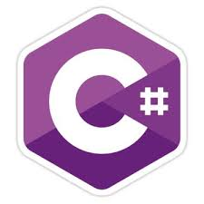

# .NET Core

Como pueden recordar, en materias previas se utilizo **.NET Framework**. Este permitia crear aplicaciones para Windows, Web, entre otros. Sin embargo, solo se podia correr en Windows, y al ser *closed-source*, era necesario el pago de licencias, depender de Microsoft para muchas cosas. Tambien contaba con varios otros problemas que lo hacen una herramienta que a veces puede resultar poco atractiva o no la mejor en muchas situaciones.

Recientemente, Microsoft decidio cambiar el rumbo y "rehacer" .NET de una manera mas ***developer-friendly***, adaptandose a las nuevas tecnologias y ambientes. Para esto, creo **.NET Core**. Cabe aclarar que no es que .NET framework dejo de existir, si no que existen en paralelo.

**.NET Core** es una plataforma de desarrollo de uso general de código abierto de cuyo mantenimiento se encargan Microsoft y la comunidad .NET en GitHub. Es multiplataforma, admite Windows, macOS y Linux y puede usarse para compilar aplicaciones de dispositivo, nube e IoT.

## Caracteristicas 

`.NET Core` tiene las siguientes características positivas en comparacion con `.NET Framework`:

* **Multiplataforma:** se ejecuta en los sistemas operativos Windows, macOS y Linux.
* **Coherente entre arquitecturas:** el código se ejecuta con el mismo comportamiento en varias arquitecturas, como x64, x86 y ARM.
* **Herramientas de línea de comandos:** incluye herramientas de línea de comandos sencillas que se pueden usar para el desarrollo local y en escenarios de integración continua. Esto es una ventaja **critica** en comparacion con `.NET framework`. 
* **Implementación flexible:** se puede incluir en la aplicación o se puede instalar de forma paralela a nivel de usuario o de equipo. Se puede usar con contenedores de Docker facilmente.
* **Compatible:** .NET Core es compatible con .NET Framework, Xamarin y Mono, mediante `.NET Standard`, el cual es un conjunto de APIs estables en comun entre todos. Esto favorece enormemente el reuso de codigo.
* **Código abierto:** la plataforma .NET Core es de código abierto, con licencias de MIT y Apache 2. .NET Core es un proyecto de .NET Foundation.
* **Compatible con Microsoft, entre otros:** .NET Core incluye compatibilidad con Microsoft y con muchisimas otras plataformas. 

## Lenguajes

Los lenguajes C#, Visual Basic y F# pueden usarse para escribir aplicaciones y bibliotecas para .NET Core. En este curso utilizaremos **C#** exclusivamente.

 

## Composicion

Es importante aclarar la composicion de toda la plataforma que utilizaremos. .NET Core es el framework del lenguaje. Esto significa que se encarga pura y exclusivamente de proveer maneras de utilizar cosas como:

* Tipos primitivos como bool e int.
* Colecciones, como System.Collections.Generic.List<T> y System.Collections.Generic.Dictionary<TKey,TValue>.
* Tipos de utilidades, como System.Net.Http.HttpClient y System.IO.FileStream.

Entre otras funcionalidades.

Dado esto, todo nuestro ambiente de trabajo se compone de las siguientes partes:

* **El runtime de .NET Core:** Proporciona todo lo que fue mencionado previamente
* **El runtime de ASP.NET Core:** Proporciona una plataforma en la que se pueden crear modernas aplicaciones conectadas a Internet, Apps Web, Backends, etc. ASP.NET es el framework creado que corre **sobre** .NET Core para hacer webs.
* **Las herramientas de CLI de .NET Core y compiladores de lenguaje:** (Roslyn y F#) habilitan la experiencia de desarrollador de .NET Core.
* **La herramienta dotnet:** Se usa para iniciar aplicaciones .NET Core y herramientas de CLI.

## Mas info

Si se desea indagar mas en .NET Core, sus ventajas y sus funcionalidades, se puede leer la excelente documentacion oficial provista [aqui](https://docs.microsoft.com/es-es/dotnet/core/about)