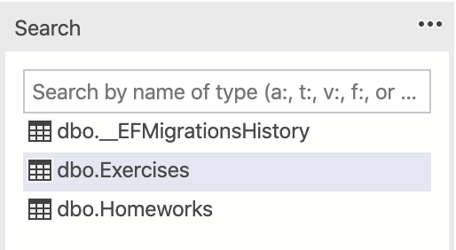

{\rtf1\ansi\ansicpg1252\cocoartf2511
\cocoatextscaling0\cocoaplatform0{\fonttbl\f0\fswiss\fcharset0 Helvetica;}
{\colortbl;\red255\green255\blue255;}
{\*\expandedcolortbl;;}
\paperw11900\paperh16840\margl1440\margr1440\vieww10800\viewh8400\viewkind0
\pard\tx566\tx1133\tx1700\tx2267\tx2834\tx3401\tx3968\tx4535\tx5102\tx5669\tx6236\tx6803\pardirnatural\partightenfactor0

\f0\fs24 \cf0 # Clase 3 - Entity Framework Core - Code First\
\
  \
\
## Instalacion de ambiente\
\
  \
\
* SQL Server\
\
* Version: **2017**\
\
* Instalacion\
\
*  **Windows**: Es mas simple, seguir los pasos de [aqu\'ed](https://docs.microsoft.com/en-us/sql/database-engine/install-windows/install-sql-server?view=sql-server-2017)\
\
*  **MacOS**: Requiere un par de pasos mas. Es necesario instalar Docker: Seguir los pasos de [aqu\'ed](https://adamwilbert.com/blog/2018/3/26/get-started-with-sql-server-on-macos-complete-with-a-native-gui), [aqu\'ed](https://database.guide/how-to-install-sql-server-on-a-mac/), o [aqu\'ed](https://richminchuk.io/connecting-to-a-local-microsoft-sql-server-on-macos-with-docker-and-dotnet-core)\
\
* SQL GUI\
\
* Existen varias GUI para manejar las bases de datos\
\
*  **Windows:**: La mejor opcion es SQL Server Management Studio. Es la GUI mas completa para interactuar con estas bases de datos. Solo disponible para windows. [Link](https://docs.microsoft.com/en-us/sql/ssms/download-sql-server-management-studio-ssms?view=sql-server-2017)\
\
*  **MacOS/Linux**: Existen otras opciones. La mejor es [Azure Data Studio](https://github.com/Microsoft/azuredatastudio), herramienta open source de microsoft disponible para todas las plataformas (Windows, MacOS, Linux. Tambien se encuentra [DBeaver](https://dbeaver.io/)\
\
  \
\
## Paquetes Necesarios para trabajar\
\
  \
\
Paquete | Descripci\'f3n\
\
------------ | -------------\
\
`Microsoft.EntityFrameworkCore`| EF Core\
\
`Microsoft.EntityFrameworkCore.Design`| Contiene toda la l\'f3gica de design-time para EF Core. Contiene clases que nos serviran para indicarle a EF Tools por ejemplo como crear un contexto.\
\
`Microsoft.EntityFrameworkCore.SqlServer`| Es el provider para la bd Microsoft SQL Server\
\
`Microsoft.EntityFrameworkCore.Tool`| Este paquete permite la ejecuci\'f3n de comandos de entityframework (dotnet ef). Este permite hacer m\'e1s f\'e1cil realizar varias tareas de EF Core, como: migraciones, scaffolding, etc\
\
`Microsoft.EntityFrameworkCore.InMemory`| (Opcional) Es un provider para bd en Memoria, es sobretodo \'fatil para testing.\
\
  \
\
Debemos tener todas estas librerias instaladas (mediante `dotnet add ...`) para usar EF Core.\
\
  \
\
## Proyecto\
\
  \
\
Trabajaremos principalmente sobre el proyecto **DataAccess**, el cual tiene la responsabilidad de interactuar con la base de datos.\
\
**Falta !!!\
Poner link al proyecto base\
Poner un link al UML de este proyecto**\
\
  \
\
## Diferencias EF Core y EF6\
\
  \
\
* EF6 funciona con .NET Framework 4.X, lo cual significa que funciona solo en Windows. Es una evoluci\'f3n del producto que fue creado hace varios a\'f1os.\
\
* EF Core es una reescritura completa del framework. Busca replicar la experiencia de EF6.\
\
  \
\
Para ver la comparacion feature por feature y obtener mas informaci\'f3n [aqu\'ed](https://docs.microsoft.com/en-us/ef/efcore-and-ef6/)\
\
  \
\
## DB Context de Referencia\
\
  \
\
Para empezar, crearemos un DbContext. Repasando, el DbContext es una parte integral de Entity Framework. Una instancia de un DbContext representa una sesi\'f3n con la base de datos, la cual puede ser usada para realizar consultas y guardar registros de las entidades.\
\
  \
\
Para mas informacion, se puede leer en la [documentaci\'f3n oficial](https://docs.microsoft.com/en-us/ef/core/) o en este [tutorial](http://www.entityframeworktutorial.net/efcore/entity-framework-core-dbcontext.aspx)\
\
  \
\
```\
using  Microsoft.EntityFrameworkCore;\
\
using  Homeworks.Domain;\
\
namespace  Homeworks.DataAccess\
\
\{\
	public  class  HomeworksContext : DbContext\
	\{\
		public  DbSet<Homework> Homeworks \{ get; set; \}\
		public  DbSet<Exercise> Exercises \{ get; set; \}\
		public  HomeworksContext(DbContextOptions  options) : base(options) \{ \}\
	\}\
\}\
```\
\
  \
\
Definimos dos DbSets; Cada uno de estos representara una tabla en la base de datos. Cabe destacar que hay que agregar las instrucciones `using`, las cuales indican que estamos usando otro proyecto. En este caso, debemos importar `EntityFrameworkCore`\
\
  \
\
## Actualizacion de clases del dominio\
\
  \
\
Le haremos unas peque\'f1as actualizaciones a las clases de nuestro dominiom, agregando unos metodos. Vamos a `Homeworks.Domain` y actualizamos ambas clases: `Homeworks` y `Exercices`:\
\
  \
\
**Exercise:**\
\
```\
using  System;\
namespace  Homeworks.Domain\
\{\
	public  class  Exercise\
	\{\
		public  Guid  Id \{get; set;\}\
		public  string  Problem \{get; set;\}\
		public  int  Score \{get; set;\}\
		public  Exercise() \{ Id = Guid.NewGuid();\}\
		public  bool  IsValid()\{ return  true; \}\
\
		public  Exercise  Update(Exercise  entity)\
			\{\
				if (entity.Problem != null)\
					Problem = entity.Problem;\
				return  this;\
			\}\
	\}\
\}\
```\
\
  \
\
**Homework**\
\
```\
using  System;\
using  System.Collections.Generic;\
namespace  Homeworks.Domain\
\{\
	public  class  Homework\
	\{\
		public  Guid  Id \{get; set;\}\
		public  DateTime  DueDate \{get; set;\}\
		public  string  Description \{get; set;\}\
		public  List<Exercise> Exercises \{get; set;\}\
\
		public  Homework()\
		\{\
			Id = Guid.NewGuid();\
			Exercises = new  List<Exercise>();\
		\}\
		public  bool  IsValid() \{ return  true; \}\
			public  Homework  Update(Homework  entity)\
			\{\
				if (entity.Description != null)\
					Description = entity.Description;\
				return  this;\
			\}\
		\}\
\}\
```\
\
  \
\
No es necesario entender estos cambios ahora. Son algunos metodos que nos ayudaran a futuro.\
\
  \
  \
\
## Microsoft SQL Server\
\
  \
\
Ahora crearemos la conexion con SQL Server.\
\
  \
Crearemos una clase ContextFactory dentro de **Homeworks.DataAccess**. Esta indica como crear la conexi\'f3n con la base de datos. Crearemos la contextFactory para que soporte MSQLS (Microsoft SQL server). Dentro del metodo `GetNewContext`, se obtiene una configuraci\'f3n para conectarse a la base de datos y se crea el contexto (en este caso, `HomeworksContext`).\
\
  \
\
```\
\
using  Microsoft.EntityFrameworkCore;\
\
using  Microsoft.EntityFrameworkCore.Design;\
\
  \
  \
\
namespace  Homeworks.DataAccess\
\
\{\
\
public  enum  ContextType \{\
\
MEMORY, SQL\
\
\}\
\
  \
\
public  class  ContextFactory : IDesignTimeDbContextFactory<HomeworksContext>\
\
\{\
\
public  HomeworksContext  CreateDbContext(string[] args) \{\
\
return  GetNewContext();\
\
\}\
\
  \
\
public  static  HomeworksContext  GetNewContext(ContextType  type = ContextType.SQL) \{\
\
var  builder = new  DbContextOptionsBuilder<HomeworksContext>();\
\
DbContextOptions  options = null;\
\
if (type == ContextType.MEMORY) \{\
\
options = GetMemoryConfig(builder);\
\
\} else \{\
\
options = GetSqlConfig(builder);\
\
\}\
\
return  new  HomeworksContext(options);\
\
\}\
\
  \
\
private  static  DbContextOptions  GetMemoryConfig(DbContextOptionsBuilder  builder) \{\
\
builder.UseInMemoryDatabase("HomeworksDB");\
\
return  builder.Options;\
\
\}\
\
  \
\
private  static  DbContextOptions  GetSqlConfig(DbContextOptionsBuilder  builder) \{\
\
//TODO: Se puede mejorar esto colocando en un archivo externo y obteniendo\
\
// desde all\'ed la informaci\'f3n.\
\
builder.UseSqlServer(@"Server=127.0.0.1,1433;Database=HomeworksDB;User Id=sa;Password=Abcd1234;");\
\
return  builder.Options;\
\
\}\
\
\}\
\
\}```\
\
  \
\
Primera carateristica importante que notaran es que ahora ContextFactory est\'e1 implementando **IDesignTimeDbContextFactory**. Esta Interfaz le indica a EF Tools como crear los db context, para ello nos pide implementar el siguiente metodo **CreateDbContext**\
\
  \
\
Tambi\'e9n agregamos el m\'e9todo `GetSqlConfig` que se encarga de crear la configuraci\'f3n para la conexi\'f3n a MSQLS. Para esto simplemente hacemos `builder.UseSqlServer` y le pasamos el connection string.\
\
  \
\
Esta clase sera la que utilizemos **siempre** que queramos crear un contexto para manipular o acceder la base de datos. Si no implementamos `IDesignTimeDbContextFactory`, EntityFramework no puede conectarse a la DB.\
\
  \
\
**Importante:** Si no les encuentra algun metodo (como `**builder.UseSqlServer**`), es porque talvez se olvidaron de agregar alguno de los paquetes:\
\
  \
\
```\
\
dotnet add package Microsoft.EntityFrameworkCore.Design\
\
dotnet add package Microsoft.EntityFrameworkCore.Tool\
\
dotnet add package Microsoft.EntityFrameworkCore.SqlServer\
\
```\
\
  \
\
### Connection string\
\
  \
\
en el metodo `builder.UseSqlServer(...)`, vemos como se pasa el connection string por parametro. Este indica los parametros necesario para conectarse a la base de datos local. El string ingresado previamente funciona perfectamente para Windows.\
\
  \
\
En caso de estar en MacOS/Linux y estar utilizando `Docker` para la base de datos, es necesario modificarlo:\
\
  \
\
```\
\
builder.UseSqlServer(@"Server=127.0.0.1,1433;Database=HomeworksDB;User Id=sa;Password=Abcd1234;");\
\
```\
\
  \
\
Aqui ingresamos directamente la IP de la computadora y el puerto, ademas de ingresar los datos de autenticaci\'f3n.\
## Cuando se haga el deploy en equipos remotos est IP va cambiar, de ah\'ed lo bueno que no est\'e9 dentro del c\'f3digo, sino habr\'eda que compilar para cambiar esto. Nosotros NO queremos esto.\'bfD\'f3nde va entonces?\
\
  \
\
## Creaci\'f3n de la BD\
\
  \
\
EF Core, a diferencia del viejo EF, no nos crear\'e1 autom\'e1ticamente la BD si no se encuentra en MSQLS, entonces para resolver esto tenemos que crear la BD a trav\'e9s de una migraci\'f3n.\
\
  \
\
Para esto debemos pararnos en el proyecto de `Homeworks.WebApi` en la consola y lanzar el siguiente comando:\
\
  \
\
```\
\
dotnet ef migrations add CreateHomeworksDB -p ../Homeworks.DataAccess\
\
```\
\
  \
\
**Porque correrlo desde HomeworksWebApi?** Leer la parte de `troubleshooting` para entenderlo.\
\
  \
\
*con el parametro -p [proyecto], se coloca el proyecto donde se encuentra el db context. En nuestro caso, es el de DataAccess. Usamos `../Homeworks.DataAccess` asumiendo que estamos dentro de la carpeta Homeworks.WebApi*\
\
  \
\
**Output**:\
\
  \
\
\
\
  \
\
Si vamos al proyecto `Homeworks.DataAccess`, nos debi\'f3 haber generado una carpeta llamada Migrations con la migraci\'f3n:\
\
  \
\
![Imagen CreateHomeworksDB (../Resources/Clase3/migrationsCreated.PNG)\
\
  \
\
Despu\'e9s de crear la migraci\'f3n es necesario ejecutarla. Para eso, utilizaremos el siguiente comando:\
\
  \
\
```\
\
dotnet ef database update -p ../Homeworks.DataAccess\
\
```\
\
  \
\
Output:\
\
  \
\
![Succesful migration (../Resources/Clase3/migracionCreateDB.PNG)\
\
  \
\
Podemos ver que las tablas y la DB fueron creadas efectivamente:\
\
  \
\
\
\
  \
\
## Migraciones\
\
  \
\
Las migraciones son la manera de mantener el schema de la BD sincronizado con el Dominio, por esto cada vez que se modifica el dominio se deber\'e1 crear una migracion.\
\
  \
\
Commando | Descripci\'f3n\
\
------------ | -------------\
\
`dotnet ef migrations add NOMBRE_DE_LA_MIGRATION` | Este comando crear\'e1 la migraci\'f3n. Crea 3 archivos: **1) .cs**: Contiene las operaciones Up() y Down() que se aplicaran a la BD para remover o a\'f1adir objetos. **2) .Designer.cs:** Contiene la metadata que va a ser usada por EF Core. **3) .ModelSnapshot.cs:** Contiene un snapshot del modelo actual. Que ser\'e1 usada para determinar qu\'e9 cambio cuando se realice la siguiente migraci\'f3n.\
\
`dotnet ef database update`| Este comando crea la BD en base al context, las clases del dominio y el snapshot de la migraci\'f3n.\
\
`dotnet ef migrations remove`| Este comando remueve la ultima migraci\'f3n y revierte el snapshot a la migraci\'f3n anterior. Esto solo puede ocurrir si la migraci\'f3n no fue aplicada todavia.\
\
`dotnet ef database update NOMBRE_DE_LA_MIGRATION`| Este commando lleva la BD al migraci\'f3n del nombre NOMBRE_DE_LA_MIGRATION.\
\
## Memoria\
\
  \
\
Es conveniente para testing usar el provider InMemory, este nos permite tener una base de datos en memoria. Permiti\'e9ndonos **no** impactar en la BD real. Las bases de datos en memoria tiene un costo casi nulo de crear, eliminar, vaciar, etc.\
\
  \
\
Para este en particular simplemente se requiere en el builder del context usar `builder.UseInMemoryDatabase` y simplemente pasarle como par\'e1metro un string con el nombre de la bd. Esto se puede ver en el `FactoryContext` m\'e1s arriba.\
\
  \
\
## Modificando nuestro proyecto\
\
  \
\
Ahora, agregaremos a nuestro proyecto la posibilidad de interactuar con la base de datos:\
\
  \
\
### Modificacion del `HomeworksRepository`\
\
  \
\
Hasta ahora, nuestro repositorio lo unico que hacia era devolver cosas `dummy`. Es decir, ningun dato real, solo unos objetos artificiales que creabamos por codigo. Lo que haremos ahora sera interactuar con la base de datos\
\
  \
\
```c#\
\
using  System;\
\
using  System.Collections.Generic;\
\
using  System.Linq;\
\
using  Homeworks.Domain;\
\
using  Microsoft.EntityFrameworkCore;\
\
  \
\
namespace  Homeworks.DataAccess\
\
\{\
\
public  class  HomeworksRepository: IDisposable\
\
\{\
\
public  HomeworksRepository(DbContext  context)\
\
\{\
\
Context = context;\
\
\}\
\
// 1 - Creacion\
\
protected  DbContext  Context \{get; set;\}\
\
  \
\
  \
\
// 2- Acceso y manipulacion de datos en la DB\
\
  \
\
public  Homework  Get(Guid  id)\
\
\{\
\
return  Context.Set<Homework>().Include("Exercises").First(x => x.Id == id);\
\
\}\
\
  \
\
public  IEnumerable<Homework> GetAll()\
\
\{\
\
return  Context.Set<Homework>().Include("Exercises").ToList();\
\
\}\
\
  \
\
public  void  Add(Homework  entity) \{\
\
Context.Set<Homework>().Add(entity);\
\
\}\
\
  \
\
public  void  Remove(Homework  entity) \{\
\
Context.Set<Homework>().Remove(entity);\
\
\}\
\
  \
\
public  void  Update(Homework  entity) \{\
\
Context.Entry(entity).State = EntityState.Modified;\
\
\}\
\
  \
\
public  void  Save() \{\
\
Context.SaveChanges();\
\
\}\
\
  \
\
// 3 - Disposing\
\
  \
\
#region IDisposable Support\
\
  \
\
private  bool  disposedValue = false;\
\
  \
\
protected  virtual  void  Dispose(bool  disposing)\
\
\{\
\
if (!disposedValue)\
\
\{\
\
if (disposing)\
\
\{\
\
Context.Dispose();\
\
\}\
\
disposedValue = true;\
\
\}\
\
\}\
\
  \
\
public  void  Dispose()\
\
\{\
\
Dispose(true);\
\
GC.SuppressFinalize(this);\
\
\}\
\
  \
\
#endregion\
\
\}\
\
\}\
```\
\
  \
\
Esta clase es grande y tiene mucho comportamiento, asi que la analizaremos por partes\
\
  \
\
1- Se crea el repositorio. Recibe en el constructor un contexto, el cual debe sera creado utilizando el `ContextFactory` que utilizamos previamente.\
\
2- En estos metodos se utiliza el `Context` para acceder a la entidad. `Context.Set<T>` se utiliza para manipular y acceder las instancias de `T` en la DB. Esto se corresponde con una tabla de la base de datos. Algunos de los metodos interesantes que vemos son:\
\
*  `.Include("")`. Cuando hay una relacion entre dos entitades (Digamos A tiene como atributo un B). Cuando obtenemos A de la DB, el atributo B viene en nulo. Debido a esto, es necesario utilizar el `.Includes("")` para decirle que tambien los traiga. Funciona tanto para atributos como para lista de elementos.\
\
*  `.First(x => ...)` es uno de los metodos que sirve para poner condiciones sobre la consulta. En este caso, retorna el primer elemento de `Homework` que cumpla la condicion definida. La condicion (en este caso booleana) se usan con [LINQ](https://docs.microsoft.com/en-us/dotnet/csharp/tutorials/working-with-linq)\
\
*  `.State = EntityState.Modified;` se utiliza para indicar que un objeto fue modificado. Si no se hace esto, cuando se guarda no se se impactan estos cambios en la DB.\
\
  \
\
3- Por ultimo, se implementa el Disposing del repositorio. Debido a que tenemos una instancia del `Context`, es muy importante hacer esto. De lo contrario, puede quedar alguna instancia del `Context` en memoria, lo cual mantendria una conecci\'f3n activa con la base de datos innecesariamente, pudiendo llevar a crashes.\
\
  \
  \
\
### Adaptando `HomeworksLogic`\
\
  \
\
Ahora usaremos nuestro nuevo repositorio en `HomeworksLogic`\
\
  \
\
```c#\
\
using  System;\
\
using  System.Collections.Generic;\
\
  \
\
using  Homeworks.Domain;\
\
using  Homeworks.DataAccess;\
\
  \
\
namespace  Homeworks.BusinessLogic\
\
\{\
\
public  class  HomeworksLogic: IDisposable\
\
\{\
\
private  HomeworksRepository  homeworksRepository;\
\
  \
\
public  HomeworksLogic() \{\
\
HomeworksContext  context = ContextFactory.GetNewContext();\
\
homeworksRepository = new  HomeworksRepository(context);\
\
\}\
\
public  Homework  Create(Homework  homework) \{\
\
//1\
\
homeworksRepository.Add(homework);\
\
//nunca olvidar esto !\
\
homeworksRepository.Save();\
\
return  homework;\
\
\}\
\
public  void  Remove(Guid  id) \{\
\
//2\
\
Homework  homework = homeworksRepository.Get(id);\
\
if (homework == null) \{\
\
//TODO: \'bfSe pueden manejar mejor los mensaje de las excepciones?\
\
throw  new  ArgumentException("Invalid guid");\
\
\}\
\
homeworksRepository.Remove(homework);\
\
//nunca olvidar esto !\
\
homeworksRepository.Save();\
\
\}\
\
  \
\
public  Exercise  AddExercise(Guid  id, Exercise  exercise)\
\
\{\
\
Homework  homework = homeworksRepository.Get(id);\
\
if (homework == null) \{\
\
//TODO: \'bfSe pueden manejar mejor los mensaje de las excepciones?\
\
throw  new  ArgumentException("Invalid guid");\
\
\}\
\
homework.Exercises.Add(exercise);\
\
homeworksRepository.Update(homework);\
\
//nunca olvidar esto !\
\
homeworksRepository.Save();\
\
return  exercise;\
\
\}\
\
  \
\
  \
\
public  Homework  Update(Guid  id, Homework  homework) \{\
\
//3\
\
Homework  homeworkToUpdate = homeworksRepository.Get(id);\
\
if (homeworkToUpdate == null) \{\
\
//TODO: \'bfSe pueden manejar mejor los mensaje de las excepciones?\
\
throw  new  ArgumentException("Invalid guid");\
\
\}\
\
homeworkToUpdate.Description = homework.Description;\
\
homeworkToUpdate.DueDate = homework.DueDate;\
\
homeworksRepository.Update(homeworkToUpdate);\
\
//nunca olvidar esto !\
\
homeworksRepository.Save();\
\
return  homeworkToUpdate;\
\
\}\
\
  \
\
public  Homework  Get(Guid  id) \{\
\
//4\
\
return  homeworksRepository.Get(id);\
\
\}\
\
  \
\
public  IEnumerable<Homework> GetHomeworks() \{\
\
return  homeworksRepository.GetAll();\
\
\}\
\
  \
\
public  void  Dispose()\
\
\{\
\
//TODO: \'bfPor qu\'e9 implementamos esto? \'bfCu\'e1ndo se usa?\
\
homeworksRepository.Dispose();\
\
\}\
\
\}\
\
\}```\
\
  \
\
1- Debido a que nuestro repositorio ahora necesita de un contexto por parametro para ser creado, creamos uno utilizando nuestro `ContextFactory`. Recordar que si no le pasamos ningun parametro a `GetNewContext`, se creara una conexion al servidor de SQL.\
\
2- Modificamos la firma de nuestro metodo `GetHomeworks` para que retorne un `IEnumerable` ahora\
\
  \
\
### Adaptando nuestros controllers\
\
  \
\
Este cambio es peque\'f1o, ya que solo cambiamos el tipo de retorno de `GetHomeworks`.\
\
  \
\
```c#\
\
public  ActionResult  Get()\
\
\{\
\
IEnumerable<Homework> homeworks = homeworksLogic.GetHomeworks();\
\
return  Ok(homeworks);\
\
\}\
```\
\
  \
\
### Rapida prueba\
\
  \
\
Ahora haremos una peque\'f1a prueba para ver que este andando todo. Corremos nuestro proyecto (recordando: `dotnet run`). Si vamos a la url `https://localhost:5001/homeworks` podemos ver una respuesta vacia (`[]`). Esto es bueno! Ya que significa que esta yendo a la DB y trayendo la informacion (en este caso, nada).\
\
  \
\
### Agregando la manipulacion de datos\
\
  \
\
Lo que agregaremos sera una manera de agregar un nuevo `Homework`, modificar un `Homework` y poder obtener un `Homework` a partir de su Id.\
\
  \
\
En `Homeworks.BusinessLogic` agregamos lo siguiente a `HomeworksLogic`.  **Debe quedar as\'ed**:\
\
  \
\
```c#\
using  System;\
\
using  System.Collections.Generic;\
\
  \
\
using  Homeworks.Domain;\
\
using  Homeworks.DataAccess;\
\
  \
\
namespace  Homeworks.BusinessLogic\
\
\{\
\
public  class  HomeworksLogic: IDisposable\
\
\{\
\
private  HomeworksRepository  homeworksRepository;\
\
  \
\
public  HomeworksLogic() \{\
\
HomeworksContext  context = ContextFactory.GetNewContext();\
\
homeworksRepository = new  HomeworksRepository(context);\
\
\}\
\
public  Homework  Create(Homework  homework) \{\
\
//1\
\
homeworksRepository.Add(homework);\
\
//nunca olvidar esto !\
\
homeworksRepository.Save();\
\
return  homework;\
\
\}\
\
public  void  Remove(Guid  id) \{\
\
//2\
\
Homework  homework = homeworksRepository.Get(id);\
\
if (homework == null) \{\
\
//TODO: \'bfSe pueden manejar mejor los mensaje de las excepciones?\
\
throw  new  ArgumentException("Invalid guid");\
\
\}\
\
homeworksRepository.Remove(homework);\
\
//nunca olvidar esto !\
\
homeworksRepository.Save();\
\
\}\
\
  \
\
public  Exercise  AddExercise(Guid  id, Exercise  exercise)\
\
\{\
\
Homework  homework = homeworksRepository.Get(id);\
\
if (homework == null) \{\
\
//TODO: \'bfSe pueden manejar mejor los mensaje de las excepciones?\
\
throw  new  ArgumentException("Invalid guid");\
\
\}\
\
homework.Exercises.Add(exercise);\
\
homeworksRepository.Update(homework);\
\
//nunca olvidar esto !\
\
homeworksRepository.Save();\
\
return  exercise;\
\
\}\
\
  \
\
  \
\
public  Homework  Update(Guid  id, Homework  homework) \{\
\
//3\
\
Homework  homeworkToUpdate = homeworksRepository.Get(id);\
\
if (homeworkToUpdate == null) \{\
\
//TODO: \'bfSe pueden manejar mejor los mensaje de las excepciones?\
\
throw  new  ArgumentException("Invalid guid");\
\
\}\
\
homeworkToUpdate.Description = homework.Description;\
\
homeworkToUpdate.DueDate = homework.DueDate;\
\
homeworksRepository.Update(homeworkToUpdate);\
\
//nunca olvidar esto !\
\
homeworksRepository.Save();\
\
return  homeworkToUpdate;\
\
\}\
\
  \
\
public  Homework  Get(Guid  id) \{\
\
//4\
\
return  homeworksRepository.Get(id);\
\
\}\
\
  \
\
public  IEnumerable<Homework> GetHomeworks() \{\
\
return  homeworksRepository.GetAll();\
\
\}\
\
  \
\
public  void  Dispose()\
\
\{\
\
//TODO: \'bfPor qu\'e9 implementamos esto? \'bfCu\'e1ndo se usa?\
\
homeworksRepository.Dispose();\
\
\}\
\
\}\
\
\}\
```\
\
  \
\
Todos estos metodos estan utilizando los metodos del repositorio que agregamos previamente.\
\
  \
\
1- Para crear uno, simplemente recibimos un `Homework` y lo agregamos. Es importante aclarar que el save es necesario, ya que si no, lo cambios no se vendran impactados en la base de datos.\
\
2- Para remover uno, recibimos el Id del `Homework` que queremos borrar. Lo buscamos en la base de datos, y lo borramos.\
\
3- Para hacer un update, recibimos el Id del `Homework` que queremos actualizar, y un `Homework` con los nuevos datos. Lo obtenemos de la base de datos, le actualizamos la informacion, y lo marcamos como actualizado.\
\
4- Por ultimo, para retornar uno en particular solo necesitamos el Id\
\
  \
\
En `Homeworks.WebApi` agregamos lo siguiente a `HomeworksController` **debe quedar as\'ed**:\
\
  \
\
```c#\
using  System;\
\
using  System.Collections.Generic;\
\
using  Microsoft.AspNetCore.Mvc;\
\
using  Homeworks.BusinessLogic;\
\
using  Homeworks.Domain;\
\
  \
\
namespace  Homeworks.WebApi.Controllers\
\
\{\
\
[Route("api/[controller]")]\
\
[ApiController]\
\
public  class  HomeworksController: ControllerBase, IDisposable\
\
\{\
\
private  HomeworksLogic  homeworksLogic;\
\
public  HomeworksController() \{\
\
homeworksLogic = new  HomeworksLogic();\
\
\}\
\
[HttpGet]\
\
public  ActionResult  Get()\
\
\{// GET api/homeworks\
\
IEnumerable<Homework> homeworks = homeworksLogic.GetHomeworks();\
\
return  Ok(homeworks);\
\
\}\
\
[HttpGet("\{id\}", Name = "Get")]\
\
// /api/homeworks/\{id\}\
\
public  IActionResult  Get(Guid  id)\
\
\{\
\
Homework  homeWorktoGet=null;\
\
try \{\
\
homeWorktoGet = homeworksLogic.Get(id);\
\
\}\
\
catch (Exception  e)\{\
\
//TODO: Log the problem\
\
\}\
\
if (homeWorktoGet == null) \{\
\
//TODO: Manejar de forma choerente los c\'f3digos\
\
return  NotFound();\
\
\}\
\
return  Ok(homeWorktoGet);\
\
\}\
\
[HttpPost]\
\
public  IActionResult  Post([FromBody] Homework  homework)\
\
\{\
\
try \{\
\
Homework  createdHomework = homeworksLogic.Create(homework);\
\
return  CreatedAtRoute("Get", new \{ id = homework.Id \}, createdHomework);\
\
\} catch(ArgumentException  e) \{\
\
return  BadRequest(e.Message);\
\
\}\
\
\}\
\
[HttpPost("\{id\}/Exercises", Name = "AddExercise")]\
\
public  IActionResult  PostExercise(Guid  id, [FromBody] Exercise  exercise)\
\
\{\
\
Exercise  createdExercise = homeworksLogic.AddExercise(id, exercise);\
\
if (createdExercise == null) \{\
\
return  BadRequest();\
\
\}\
\
return  CreatedAtRoute("GetExercise", new \{ id = createdExercise.Id \}, createdExercise);\
\
\}\
\
[HttpPut("\{id\}")]\
\
public  IActionResult  Put(Guid  id, [FromBody] Homework  homework)\
\
\{\
\
try \{\
\
Homework  updatedHomework = homeworksLogic.Update(id, homework);\
\
return  CreatedAtRoute("Get", new \{ id = homework.Id \}, updatedHomework);\
\
\} catch(ArgumentException  e) \{\
\
return  BadRequest(e.Message);\
\
\}\
\
\}\
\
[HttpDelete("\{id\}")]\
\
public  IActionResult  Delete(Guid  id)\
\
\{\
\
homeworksLogic.Remove(id);\
\
return  NoContent();\
\
\}\
\
public  void  Dispose()\
\
\{\
\
homeworksLogic.Dispose();\
\
\}\
\
\}\
\
\}\
```\
\
  \
\
Creamos las rutas para cada uno de las acciones:\
\
  \
\
*  `GET url/api/homeworks` devuelve todos los `Homework` de la DB\
\
*  `GET url/api/homeworks/\{id\}` devuelve el `Homework` con el id indicado\
\
*  `POST url/api/homeworks` crea un homework\
\
*  `PUT url/api/homeworks/id` recibe un `Homework` y actualiza el del Id\
\
*  `DELETE url/api/homeworks/id` borra el `Homework` con el id pasado\
\
  \
\
Ahora lo pueden probar. Lo pueden probar con Postman, o con la herramienta que mas como les sea. Cuando tienen que enviar un `Homework` por el body de la request, tiene que tener el siguiente formato:\
\
  \
\
```json\
\
\{\
\
"dueDate": "2020-03-15T17:16:40",\
\
"description": "a description",\
\
"exercises": []\
\
\}\
\
```\
\
  \
\
Detalles:\
\
* La fecha tiene que ser una fecha bien formada\
\
*  `Exercises` puede no ser enviado, la lista quedara vacia (no se agregara con ningun ejercicio)\
\
* El id no debe ser enviado ya que es creado automaticamente en el constructor\
\
  \
\
## Continuar con el ejemplo como ejercicio\
\
  \
\
* Agregar la misma logica pero para los `Exercises` tambien, desde el controller hasta la base de datos. Recordar que cuando se agrega un `Exercise`, es para un `Homework` especifico\
\
* Nuestros `Controllers` utilizan los modelos del dominio (Homework) directamente. Deberiamos utilizar otros modelos para esto, ya que puede ser que los modelos que se reciben por la API sean distintos a los que maneje nuestro dominio.\
\
  \
\
## Mas Info\
\
  \
\
*  [EF Core Doc](http://www.entityframeworktutorial.net/efcore/entity-framework-core.aspx): Tutorial sobre Entity Framework Core.\
\
*  [Configuring a DbContext](https://docs.microsoft.com/en-us/ef/core/miscellaneous/configuring-dbcontext)\
\
  \
  \
\
## Troubleshooting (Posibles problemas)\
\
  \
\
### Creacion de migraciones\
\
  \
\
**Build failed, sin ningun mensaje mas**\
\
  \
\
* Esto indica que el proyecto no compil\'f3 por alguna razon de primer nivel. Es necesario ver si falta alguna clase, referencia, etc.\
\
  \
\
**Startup project 'Homework.DataAccess.csproj' targets framework '.NETStandard'. There is no runtime associated with this framework, and projects targeting it cannot be executed directly**\
\
  \
\
**Primer soluci\'f3n:**\
\
  \
\
Una solucion este problema, es correr todos los comandos relacionados a las migraciones y base de datos desde el proyecto `WebApi`. Si nos fijamos en su configuracion (`.csproj`), este utiliza el framework `netcoreapp3.1`,por lo que corriendolo desde ahi funcionara tambi\'e9n.\
\
  \
\
**Segunda soluci\'f3n:**\
\
  \
\
Otra solucion es, dentro de cada uno de los proyectos, modificar el archivo `X.csproj`. Este archivo, el cual cuenta con un formato muy similar al de XML, indica la configuracion del proyecto, tales como dependencias, paquetes que utiliza, etc.\
\
  \
\
Dentro de esta configuracion, se encuentra el `TargetFramework`. Este indica con que framework se compila el proyecto. Las opciones son .NET Framework (El viejo conocido) y EF Core. La opcion por defecto es `netstandard2.0`, la cual es una interfaz que contiene las cosas en comun entre ambos frameworks. Debido a esto, no se pueden correr comandos de cosas como, por ejemplo, base de datos, con esto.\
\
  \
\
```xml\
\
<PropertyGroup>\
\
	<TargetFramework>netstandard2.0</TargetFramework>\
\
</PropertyGroup>\
\
```\
\
  \
\
El problema de esto es que es una interfaz, por lo cual no tiene un runtime. Al cambiarlo a `netcoreapp3.1`, la version que estamos utilizando en el curso, esto se soluciona\
\
  \
\
```xml\
\
<PropertyGroup>\
\
	<TargetFramework>netcoreapp3.1</TargetFramework>\
\
</PropertyGroup>\
\
```\
\
  \
\
Mas informaci\'f3n [aqu\'ed](https://docs.microsoft.com/en-us/dotnet/standard/frameworks).\
\
  \
\
**No DbContext was found in assembly ...**\
\
  \
\
\
\
  \
\
Esto pasa cuando queremos correr un proyecto el cual no tiene ningun DBContext. Fijarse que se este corriendo sobre el proyecto correcto}