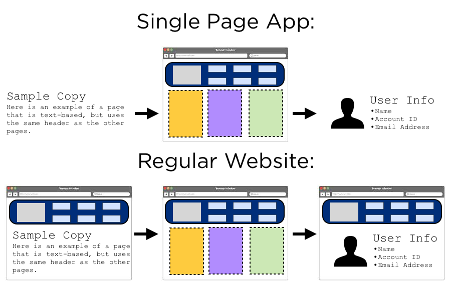
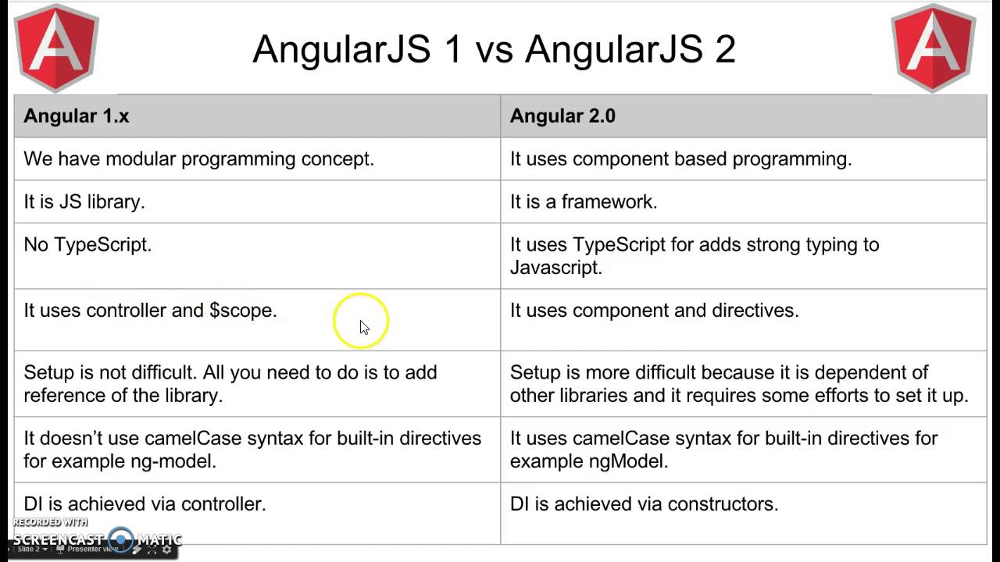
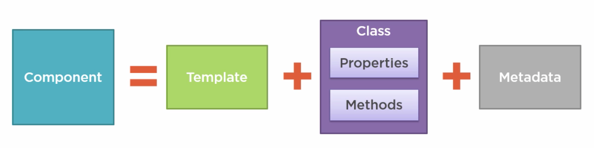
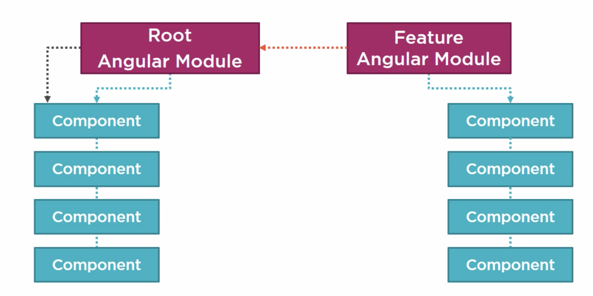
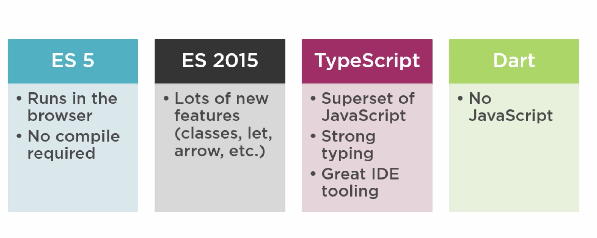
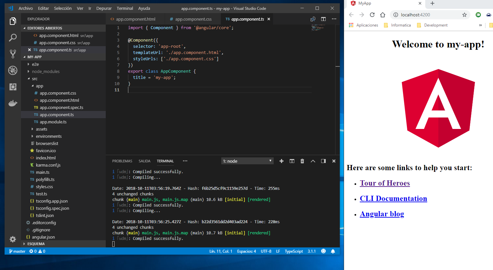
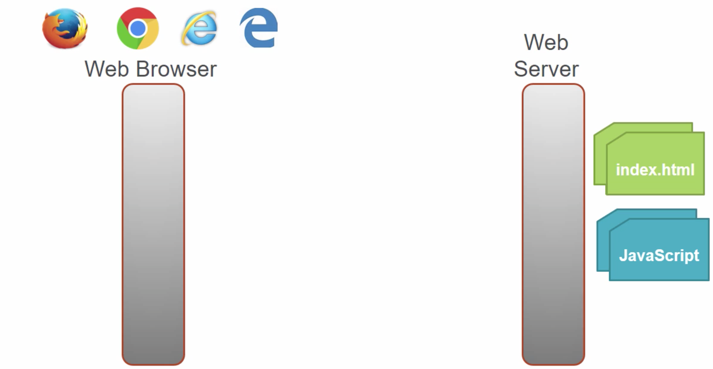
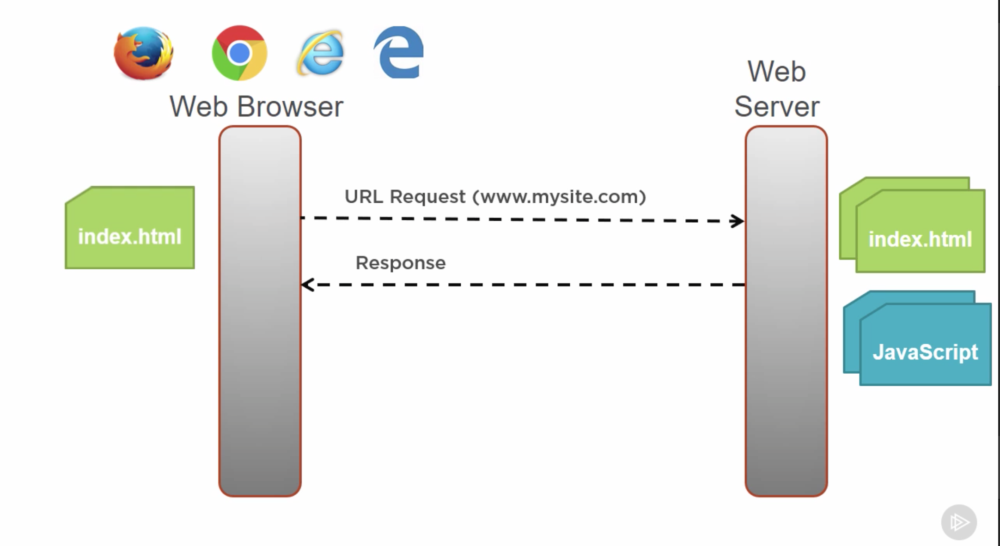

# Angular y el mundo de las SPAs

## Introducción al concepto de Single Page Applications

Esta clase tiene como objetivo introducirlos en el concepto de las SPAs y comenzar a ver a Angular como una tecnología para lograrlo.
Es interesante ver cómo esta "nueva"  forma de contruir aplicaciones web (aunque hoy en día ya tiene sus años) 
se diferencia de las maneras más "tradicionales", teniendo como objetivo entender qué diferencias residen entre una modalidad y otra.

### ¿Cómo funcionaban las web applications tradicionalmente?

En el pasado, el flujo que exista en una aplicación web era algo así:

1) Se tenía un **Web Server** que provee "al mundo" el contenido de nuestro sitio (html, js, css, etc).

2) Luego, se utilizaba un **Browser** para ir a buscar dicho contenido, a partir de una solicitud HTTP.  Por ejemplo, cada vez que entramos a **http://www.starwars.es/**

En el momento en el que obteníamos la página, nuestro **Browser/Explorador** tenía la lógica para mostrarla (renderizarla), y, en cada interacción/clic/evento subsiguiente que nosotros dispararamos sobre dicho html,
el browser se encargaba de ir a pedir un nuevo .html al Web Server para mostrar el contenido asociado al mismo.


Este tipo de aplicaciones son conocidas como **Round-Trip Applications** (o **RTAs**).

Durante mucho tiempo, las aplicaciones web se fueron pensando como Round-Trip: el Browser hace el request inicial del documento HTML al servidor, las interacciones del Usuario hacían que el browser solicitara y recibiera un documento HTML completamente nuevo cada vez. En este tipo de aplicación, **el browser es solo una especie de renderer de HTML**, y toda la lógica de la aplicación va del lado del servidor. El browser realiza una serie de Requests HTTP sin estado que el server maneja generando documentos html dinámicamente.

Este modelo, si bien se sigue usando hoy en día, tiene algunas **desventajas**. Por ejemplo:

1) El usuario debe esperar mientras el siguiente documento HTML se genera, requieren mayor infraestructura del lado del servidor para procesar todos los requests y manejar el estado de la aplicación, y requieren más ancho de banda, ya que cada documento HTML debe estar autocontenido.


2) A su vez, la experiencia de usuario se degrada por factores como el efecto de refreshing (pestañeo) y el tiempo en ir a pedir los recursos al servidor.

### ¿Cómo funcionan las SPAs? 

Las *SPAs*, si bien siguen manteniendo la misma forma de interactuar **cliente-servidor**, toman un enfoque diferente. En la petición inicial, un HTML inicial se envía al browser, pero las interacciones del usuario generan requests a través de **AJAX** para pequeños fragmentos de HTML/datos que se insertan en lo que se le muestra al usuario

**El documento HTML inicial nunca se recarga**, y el usuario puede seguir intercalando con el html existente mientras las requests ajax terminan de ejecutarse asincrónicamente.



Particularmente veremos un framework que está 100% orientado a la construcción de SPAs: **Angular**.

El mismo logra logra sus mejores resultados cuando la aplicación a desarrollar se acerca al modelo de **Single-Page**. No quiere decir que no se pueda usar para Round-trip, pero hay otras herramientas, como **jQuery**, que lo hacen mejor.

### Características de las SPAs

1) Como ya dijimos, este tipo de Web Apps es conocida porque tienen la posibilidad de redibujar la UI sin tener que realizar una nueva petición (**Round-Trip**) al servidor. 

2) Mejoran la UX por el hecho de que los usuarios tienen una experiencia ininterrumpida, sin que la página se refresque, y sin agregar complejidad. 

3) Son ideales para el mundo tanto web y mobile: no se agrega complejidad desde el lado del servidor para poder servir a diferentes dispositivos o plataformas. la lógica de lograr que nuestras web apps sean "responsive" siempre va desde el lado del cliente (browser), no se cargan nuevas páginas todo el tiempo.

4) Estan 100% alineadas al concepto de las APIs REST, debido a que estas simplemente exponen puntos para transaccionar y/o recibir o devolver datos, de una forma totalmente separada de la forma en que se van a mostrar.

## ¿Qué es Angular?


### Lectura Previa: ¿Por qué Angular?

https://medium.com/angular-japan-user-group/why-developers-and-companies-choose-angular-4c9ba6098e1c

### Introducción

* Framework de JavaScript
* Orientado a construir Client-Side Apps  
* Basado en HTML, CSS y JavaScript

La meta de angular es traer las herramientas y capacidades que han estado disponibles para el desarrollo de back-end al cliente web, facilitando el desarrollo, test y mantenimiento de aplicaciones web complejas y ricas en contenido.

Angular funciona permitiéndonos extender HTML, expresando funcionalidad a través de elementos, atributos, clases y comentarios. 

**Angular quiere resolver el problema de la complejidad de manejar el DOM  y la lógica de una aplicación manualmente**.

### ¿Por qué Angular?

* Angular hace que nuestro HTML sea más expresivo, permitiéndole embeber/agregar features y lógica al HTML para lograr un data-binding con nuestros modelos. Esto nos permite mostrar campos que tengan valores de nuestros modelos/datos de forma sencilla, y tener un seguimiento de los mismos (actualización en tiempo real). 

* Angular promueve la modularidad desde su diseño, siendo fácil crear y lograr reuso de los componentes y del contenido.

* Angular a su vez tiene soporte ya incluido para comunicación con servicios de back-end (es fácil que nuestras webs apps se conecten a nuestros backends y ejecuten leogica del lado del servidor).

### Angular 2 vs "Angular 1"

La versión del framework que usaremos es comunmente llamada como "Angular 2", o simplemente, Angular. Esta versión provee una serie de ventajas interesantes respecto a la versión anterior:

1) Es más rápido. Está más optimizado y **corre de 3-5 veces más rápido** que Angular 1 .

2) Es más moderno, y toma en cuenta **features modernas de  JavaScript** que no estaban en otros frameworks de JavaScript (clases, modelos y decorators).

3) Angular 2 tiene una API simple que se engancha con varios exploradores.

4) Mejora la productividad de forma sencilla:  **define patrones y building blocks** para la construcción de web apps.

También podemos realizar una comparativa a más detallada:



De aquí en adelante, siempre que hablemos de *Angular*, nos estaremos refiriendo a *Angular 2*.

## Arquitectura de una aplicación Angular


En **Angular**, una aplicación **se define a partir de un conjunto de componentes**, del mismo modo que también de servicios subyacentes que son comunes a ellos  y permiten el reuso de la lógica. Por ejemplo: servicios para contectarse con APIs REST, servicios que manejen la sesión desde el lado del cliente, servicios de autenticación, etc.

### Pero… ¿Qué es un componente en Angular?



Un componente es una una unidad modularizada que define la vista y la lógica para controlar una porción de una pantalla en Angular. Cada componente se compone de:

- Un **template (que es el HTML para la UI, tambin llamado la View)**. Sin los datos, por eso un template. Los datos serán inyectados de forma dinámico.

- Una **clase que es el código asociado a la View**, teniendo properties/datos que están disponibles para el uso de las Views, y métodos que son lógica o acciones para dichas views. Por ejemplo: responder a un click de un botón, o a un evento.

- **Metadata**, la cual provee información adicional del componente a Angular. Es lo que identifica a la clase  asociada al componente.

### ¿Y cómo hacemos que todos estos componentes se integren en una app en Angular? - Modules



Esto lo logramos a partir de lo que se llaman, **Angular Modules**. Estos nos permiten organizar nuestros componentes en funcionalidad cohesiva. Cada app angular tiene por lo menos un Angular Module, llamado el **Root Angular Module**.

Por convención, al Root Module le llamaremos **AppModule** en nuestra Angular app.

Una app puede tener un número de modulos adicionales, incluyendo **‘Feature Angular Modules’**, que los usamos para lograr una funcionalidad en especial. Consolidan un conjunto de componentes para una feature particular de una aplicación.

Los módulos de Angular, sin importar si son root o feature, son clases anotadas con el **decorator `@NgModule`**

#### Decorators

Son simplemente funciones que van a modificar nuestras clases de JavaScript. Angular define un montón de decoradores que agregan metada a las clases que vayamos definiendo, de manera que podamos agregarle funcionalidad extra a nuestras clases.

## Eligiendo un lenguaje para nuestras apps en Angular


### ECMAScript como una especificación de JS

JavaScript como lenguaje de programación, posee una especificación que define todas las reglas que este debe cumplir. Todas las versiones que vayan saliendo siempre de JavaScript, deben respetar dicha especificación/estándar, cuyo nombre es **ECMAScript** o de la forma usual en que se lo abrevia **(ES)**.

Las diferentes versiones que van saliendo, se van versionando con un número, y evidentemente cada una tiene diferente soporte en los browsers. Por ejemplo: ES3 es soportado por los browsers viejos, ES5 es actualmente la especificación que soportan todos los browsers nuevos.


Cuando queremos construir una Angular App, tenemos varias opciones de lenguajes que se adecuan con la especificación de JavaScript, y la idea aquí es ver cuál de ellas pueda resultarnos más útil.

### La necesidad de usar Transpilers


Una de las últimas y que tiene más soporte en Angular es **ES2015** (que antes se llamaba **ES6** y que fue aprobada hace 1 año apróximadamente). Esto tiene como consecuencia que la mayora de los browsers todavía no tienen soporte completo para la misma. Ver: http://kangax.github.io/compat-table/es6/

Es por esto que si usamos un lenguaje basado en ES2015, **este debe ser debe ser transpilado (transpiled), a ES2015**. Eso significa que todo el código que hagamos en ES6/ES2015 debe ser compilado por una herramienta que lo que haga es convertir toda nuestra sintaxis en ES2015 a la sintaxis ES5 **antes de que el browser lo ejecute**.

Aquí ganamos nosotros como desarrolladores, ya que podemos usar todas las features de ES2015, sin tener que abstenernos a lo que los navegadores soportan, obviamente siempre que usemos un transpilador.

### ¿Qué lenguaje usaremos? : TypeScript


Como Angular es una librería de JavaScript, podemos usar uno de los tantos lenguajes que compilan a JavaScript, para construir nuestras apps de Angular 2. Las versiones más comunes son:

* ES5
* ES2015 (también llamado ES6)
* TypeScript



Particularmente, eligiremos **TypeScript**. Este este es un superset de JavaScript y debe ser transpilado. Uno de los beneficios más importantes de TypeScript (o simplemente TS), es que es fuertemente tipado, significando que todo tiene un tipo de datos asociado (una variable, una función, un argumento, etc).

### Características de TypeScript

1) Se tienen una enormidad de ventajas a nivel de desarrollo (los IDEs pueden verificar la sintaxis, ofrecer documentación inline, code navigation, etc).

2) TypeScript es usado mismo por el equipo de Angular para desarrollar Angular. Y la documentación de Angular tiene todos los ejemplos usando TypeScript

3) Es un lenguaje OpenSource.

4) Compila a JavaScript (viejo y conocido), a través de transpilación.

5) ¿Cómo hace TS para determinar los tipos apropiados cuando usamos librerías de JavaScript que no son fuertemente tipadas? A partir de usar TypeScript definition files (*.d.ts)

6) TypeScript implementa la especificación de ES2015, y permite construir CLASES! Es orientado a objetos permitiendo usar e clases, interfaces y herencia!

Este último punto para nosotros es muy interesante por el hecho de que **tenemos un background** (desde Programación 1), en **lenguajes orientados a objetos** (C++, Java, c#, etc). Usar TypeScript va a ser más natural para todos nosotros.

### Ejercicio: PlayGround de TypeScript

Entrar al siguiente [link](https://www.typescriptlang.org/play/) y comenzar a jugar con TypeScript como lenguaje.

## Tutorial: Armando nuestro ambiente

### 1) Instalando Node


Para poder utilizar angular lo que debemos instalar son **Node.js** que es un entorno de ejecución para javascript construido con el motor de JavaScript V8 de Chrome y **NPM** o (*Node Package Manager*) es una **Command Line Utility** que nos permite interactuar, de una forma muy simple, con un repositorio enorme de proyectos *open-source*. Ha ganado muchísima popularidad al punto en que se ha convertido en EL package-manager para JavaScript. Con él, podemos instalar librerías, paquetes, aplicaciones, en conjunto con las dependencias de cada uno.

Lo bajaremos desde aquí: https://nodejs.org. Donde descargaremos la version recomendada.

#### ¿Por qué lo usaremos en nuestras Apps de Angular? 

1) Lo vamos a usar para instalar todas las librerías de Angular, es decir las dependencias.

2) También para ejecutar los transpiladores de nuestro código. NPM nos permitirá correr el compilador que convierta todos nuestros **.ts** en **.js**, de una forma muy simple, para que el navegador los pueda reconocer correctamente.

3) Funciona también como **WebServer**, que "servirá" nuestras Angular SPAs, en un web server liviando que levanta. Esto es mucho más cercano a un escenario real y evita problemas que suelen existir cuando accedemos directamente a los archivos a partir de su path en disco (`file://miarchivo.html`)

### 2) Construyendo nuestro ambiente de desarrollo

1. Crear una carpeta que contendrá nuestra aplicación.
2. Agregar los archivos de configuración y definición de paquetes.
3. Instalar dichos paquetes (usando npm).
4. Crear el modulo root de nuestra app angular (recordemos que toda app en Angular precisa de uno!).
5. Creamos el main.ts, que carga dicho modulo angular.
6. Creamos la página web host, (normalmente llamada index.html).

Estos pasos los podemos hacer manuales cómo se dice en htttp://www.angular.io

### Iniciando con ANGULAR

1. **Configurar el entorno de desarrollo** - Instalamos Angular CLI ```npm install -g @angular/cli``` (este comando instala el cli de angular de manera global y solo debemos ejecutarlo cuando no se encuentra el CLI en nuestra pc)
2. **Creamos nuestro proyecto** -  ```ng new NombreDelProyecto``` (si no se coloca un nombre se crea en el proyecto actual)
3. **Ejecutamos nuestro proyecto** - ```ng serve --open``` (--open habre una ventana en el navegador en ```http://localhost:4200/```)

### 3) ¿Qué sucede al levantar nuestra app?

Al arrancar nuestra app usamos el comando ```ng serve```. Esto lo que hace es levantar un Web Server para que nuestro navegador pueda consumir los archivos desde ahí, es simplemente un ambiente local que funciona como un ambiente real.
A su vez, vemos comos se ejecuta **tsc, el TypeScript Compiler**, el cual compila nuestros .ts y los transpila a .js. Como vemos en el VisualStudioCode, vemos que por cada `.ts` que nosotros tenemos, se nos crean un `.js` y un `.js.map`, que fueron generados por el typescript compiler, que transpiró todos nuestros .ts para que el browser pueda entenderlos.
También vemos que el TypeScript compiler y el FileServer que levantamos, “watchea” cualquier cambio a nivel de código, de manera que cada vez que hacemos un cambio en nuestro código, TypeScript lo recompila y podemos ver los cambios en el navegador.

Ejemplo:

* 1  Cambio el Componente de APP

* 2  Guardo y veo como el watcher se activa

* 3 Instantáneamente mis cambios en la vista se reflejan en el navegador

### 4) El punto de entrada de nuestra aplicación: index.html

Este es el documento que es llevado desde el Web Server hasta el navegador, aquí comienza a ejecutarse toda nuestra aplicación en Angular.

El proceso es similar a cómo describimos al principio:

Se realiza una request del navegador al web Server:




Y este le contesta:



#### ¿Qué contiene?

```html
<!doctype html>
<html lang="en">
<head>
  <meta charset="utf-8">
  <title>MyApp</title>
  <base href="/">

  <meta name="viewport" content="width=device-width, initial-scale=1">
  <link rel="icon" type="image/x-icon" href="favicon.ico">
</head>
<body>
  <app-root></app-root>
</body>
</html>
```

- Lo unico que interesante que destacar <app-root></app-root> que hace referencia a nuestro componente principal app.component.
- Casi nunca sera necesario editarlo, el CLI se encargara de añadir los archivos js y css al momento del building.

#### ¿Y nuestro main.ts?

```js
import { enableProdMode } from '@angular/core';
import { platformBrowserDynamic } from '@angular/platform-browser-dynamic';

import { AppModule } from './app/app.module';
import { environment } from './environments/environment';

if (environment.production) {
  enableProdMode();
}

platformBrowserDynamic().bootstrapModule(AppModule)
  .catch(err => console.error(err));
```

Es el punto de entrada de nuestra aplicacion. Compila la aplicación con el compilador JIT y arranca el módulo raíz de la aplicación (AppModule) para ejecutarse en el navegador. También puede se puede usar el compilador AOT sin cambiar ningún código agregando el indicador - aot a los comandos ng build y ng serve.
